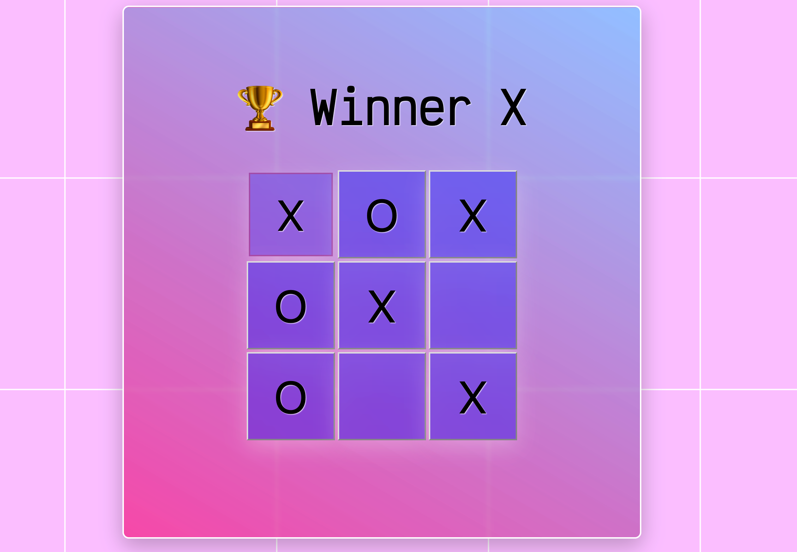

# Tic-Tac-Toe


A classic but popular game built with **React** and **TypeScript**.\
➡️ The project demonstrates how PropTypes can be replaced by the use of TypeScript.
And this comes with a bunch of benefits over PropTypes like:

- compile-time checking instead of runtime checking
- no need for additonal dependency (prop-types)
- more precise type definitions
- type inference for variables

➡️ TSX solution for PropTypes:

```bash
interface SquareProps {
  value: string | null;
  onSquareClick: () => void;
}

const Square = ({ value, onSquareClick }: SquareProps) => {
  return (
    <button className="square" onClick={onSquareClick}>
      {value}
    </button>
  );
};

export default Square;
```
  
## Installation

```bash
git clone https://github.com/tpreisig/tictactoe-forever
npm install
npm run dev
```

➡️ The game will be available at `http://localhost:3000`

## License

This project is licensed under the MIT License - see the [LICENSE](LICENSE) file for details.

## Visuals



## Contact

Maintained by tpreisig - feel free to reach out!
